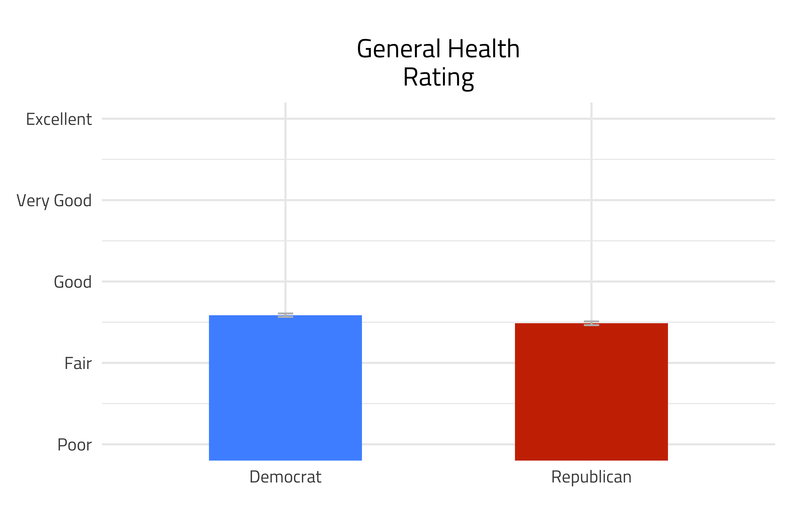

<style type="text/css">

h1.title {
  font-size: 38px;
  text-align: center;
}
h4.author { 
    font-size: 18px;
  text-align: center;
}
h4.date { 
  font-size: 18px;
  text-align: center;
}
</style>

&nbsp;&nbsp;&nbsp;&nbsp;&nbsp; Are Republicans healthier than Democrats, and could this partially explain partisans' divergent responses to Covid-19? 

&nbsp;&nbsp;&nbsp;&nbsp;&nbsp; There are a number of health conditions that make people more vulnerable to Covid. While people should take precautions regardless of their health or age, it is natural for people at higher risk to be more careful. If risk is more concentrated among Democrats, it could help explain at least some of the [gap](https://bfi.uchicago.edu/wp-content/uploads/BFI_White-Paper_Bertrand_2.2020.pdf) in precautionary measures taken between Republicans and Democrats.
<!-- Would like to show reserach for precautions by risk -->

&nbsp;&nbsp;&nbsp;&nbsp;&nbsp; The 2012 wave of the Cooperative Campaign Election Study asked a short battery of health related questions that can be used to explore health differences by partisanship. While there are a lot of surveys about politics, and a good number of surveys that ask health questions, surveys that ask about both *health* and *partisanship* are rare. It would be nice to analyze a more recent survey, but partisanship is stable enough that it's unlikely a more recent survey would yield dramatically different results. 

&nbsp;&nbsp;&nbsp;&nbsp;&nbsp; The graph below shows the percentage of Republicans and Democrats with various health conditions. Democrats have more asthma and smoke more, but Republicans are a bit more likely to have high cholesterol, high blood pressure, and heart disease. Overall, most of the differences are small. 

```{r health_party_graph, echo=FALSE, fig.cap=""}

```

&nbsp;&nbsp;&nbsp;&nbsp;&nbsp; To better contextualize average health differences between Democrats and Republicans, it's important to highlight the age differences between the parties. Most Republicans are far older than Democrats, as the figure below shows.^[I cut the data off for people above age 80 because the sample size gets small and it's unclear how many 80+ year olds are answering an online survey like the CCES. Every integer age gets a dot on the graph. This may overfit a bit, but since the CCES has a sample of over 50,000, almost every dot represents at least 100 people.]

```{r age_party, echo=FALSE, fig.cap=""}

```

&nbsp;&nbsp;&nbsp;&nbsp;&nbsp; When we compare Democrats and Republicans of the same age, are Republicans more healthy? The graph below plots the proportion of Democrats and Republicans with various health conditions across different ages. For all conditions besides heart disease, Democrats are at higher risk when comparing Republicans and Democrats at the same age. The differences for asthma and smoking are stark, but the rest are relatively small. 

```{r age_health_final_figure, echo=FALSE, fig.cap="", out.width = '100%'}

```

&nbsp;&nbsp;&nbsp;&nbsp;&nbsp; After comparing health by partisanship and age, the next natural question is to compare the health of Democrats and Republicans after adjusting for a full battery of demographic variables. (Specially, race, gender, education, family income, employment status, and location.) The graph below shows the average difference in health conditions between Republicans and Democrats in the aggregate, after adjusting for age, and after adjusting for all demographics. The model with covariates follows research (e.g. [here](https://papers.ssrn.com/sol3/papers.cfm?abstract_id=3562796)  [here](https://www.dataforprogress.org/blog/2020/6/21/the-emergent-partisan-gap-in-social-distancing) and [here](http://web.stanford.edu/~gentzkow/research/social_distancing.pdf)) that controls for demographics while studying partisan differences in following public health guidance. While these models include demographic variables, they do not control directly for health, so if there is still a gap in health between Democrats and Republicans after adjusting for demographics, it could help explain the difference in partisan responses. 
&nbsp;&nbsp;&nbsp;&nbsp;&nbsp; Across most conditions, Republicans are slightly healthier than Democrats, even after adjusting for demographics. However, the gaps continue to be relatively small. Thus, health differences are unlikely to explain much of the difference in mask wearing and other behaviors between Republicans and Democrats.^[Even if Republicans were at less risk for Covid because they had fewer underlying health conditions that would make them vulnerable, I am still assuming having underlying conditions like asthma and high blood pressure increase the likeihood of following public health guidance]. I of course can't test this using survey data from 2012, and I am unaware of any direct tests with more recent data.]

```{r health_covariate_adjusted, echo=FALSE, fig.cap="", out.width = '100%'}

```

<!-- #Maybe this should include covariate adjusted? -->

&nbsp;&nbsp;&nbsp;&nbsp;&nbsp; Of course, the conditions covered thus far are not comprehensive--they just happened to be asked in a survey along with partisanship. However, there is a question that asks respondents to rate their "general health" shown below. On average, people rate their health just a bit more than "fair", and Democrats self-ratings are slightly higher than Republicans.


```{r general_health_graph, echo=FALSE, fig.cap="", out.width = '100%'}

```

&nbsp;&nbsp;&nbsp;&nbsp;&nbsp; Importantly, "general health" is a subjective assessment while other questions about specific conditions provided more objective indicators of health.^[Even these questions aren't completely unbiased indicators because some people may have conditions undiagnosed if they lack access to health care.] For one person, having asthma may cause them to rate their health as fair, while another person might not think of their asthma as that significant and rate their health as very good. It's possible that Republicans and Democrats with the same objective health rate themselves in a systematically different way. 

&nbsp;&nbsp;&nbsp;&nbsp;&nbsp; I try to test for this dynamic by assessing how the general health penalty for different health conditions varies between the parties. For instance, I test whether a Republican with asthma rates their health as worse than a Democrat with asthma, after adjusting for all other health conditions as well as demographics.^[More technically, in a regression predicting general health, I interact all the health conditions with partisanship.]  The graph shows that Democrats and Republicans adjust their overall health rating similarly for various conditions. For instance, both Democrats and Republicans adjust their general health rating down half a point (on a 1-5 scale from poor to excellent) if they have heart disease. 

&nbsp;&nbsp;&nbsp;&nbsp;&nbsp; This cannot eliminate all caveats when comparing subjective assessments across groups. For instance, it's possible Democrats have more severe asthma or lack treatment compared to Republicans, making Democrats with asthma rate their general health as worse than Republicans with asthma. By adjusting for factors like family income and age that could be systemically correlated with the severity of various conditions I help guard against this possibility, but it's certainly not perfect. 


```{r general_health_penalty, echo=FALSE, fig.cap="", out.width = '100%'}

```


&nbsp;&nbsp;&nbsp;&nbsp;&nbsp; Overall, there are not large health differences between Republicans and Democrats that make health a likely explanation for the differential adherence adherence to public health. Explanations based on [trust in science](https://papers.ssrn.com/sol3/papers.cfm?abstract_id=3587990) and [following party leaders](https://uc37bb42f68f2864a9f08a26dfda.dl.dropboxusercontent.com/cd/0/inline2/A70dgow4epZAMT0kdISHSh4YPeNM2GFvw0J17OaQd6wt-i_imrKYPBQ2Qdi6Z0Qi9wJXXSFxbrRe714J-8CErA_w7xuMHt9F1xYyWbF0D76_DhkwvNf8uG0NB33Hh2pWmaOlANRTXpyh8nRyzt7DBVNtg9fjb_BuW3afIzoq8UKzd3LX7yASaijDPetG59DYHr-zpp_sgZE0nUgypc2_jUjQqMhyzafPduARzBvif-aBA5zIq3dIeMQ68Rd1MWqHOOgF7H-Qnw7Xku6PxdVEnNbKz8_rxxlH8yUotZqF21FKl2ZgJ2QOAjvgIJaiAgzmVoW5LBrBvNbwQXnNNYmWiyfmI8MkFM6iLeKl0pa1VIUTow/file#) are much more plausible. However, it would still be nice to test if people with higher risk for covid take more precautionary measures and if adjusting for health conditions could narrow the partisan gap in behavior. 


